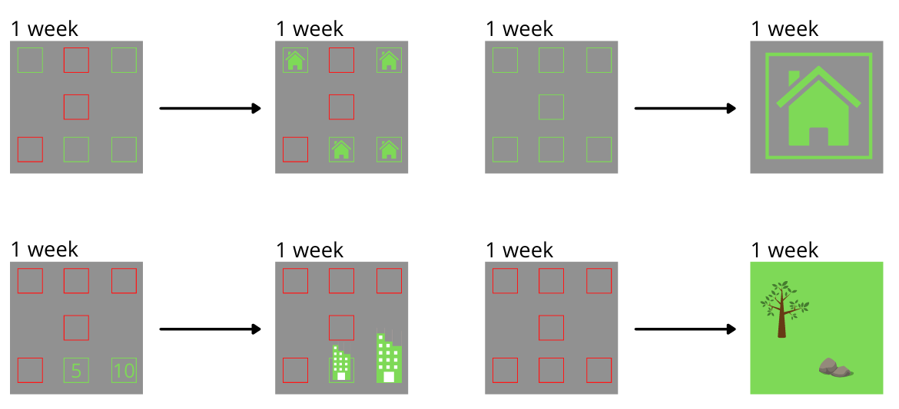

# GitHubCity
Visualize your GitHub contributions as a city

## Presentation of the project
### What is this?
It's a [gamification](https://en.wikipedia.org/wiki/Gamification) app about your daily GitHub contributions

### How it works?
- We'll use the GitHub API to connect users and get them contributions stats
- With these stats a city will be generated as [SleepTown mobile App](https://sleeptown.seekrtech.com/)

#### Specs
For 1 complete week of low (less than 4) contributions → restaurant, shop, ...

For 1 complete week of high (+4) contributions → church, hotel, town hall, ...

For 1 incomplete week of contributions:
- 1 daily contribution (-3) → house
- 1 daily contribution (+3) → skyscraper (more high depending on the sum)

##### 1 week = 1 square
If 1 contribution is done during one week, we plug all square (1 week) with roads
Else, put trees and wild stuff on non-contributed square

##### Schema

Useful links:
- https://threejs.org/
- https://demos.littleworkshop.fr/infinitown
